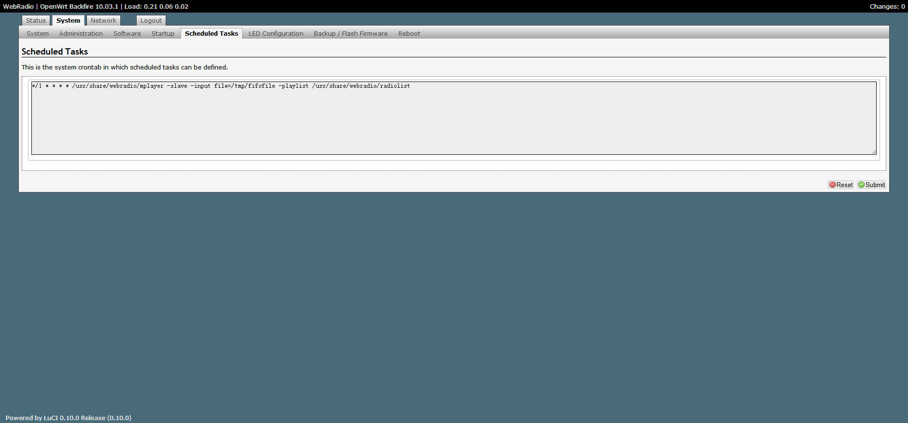
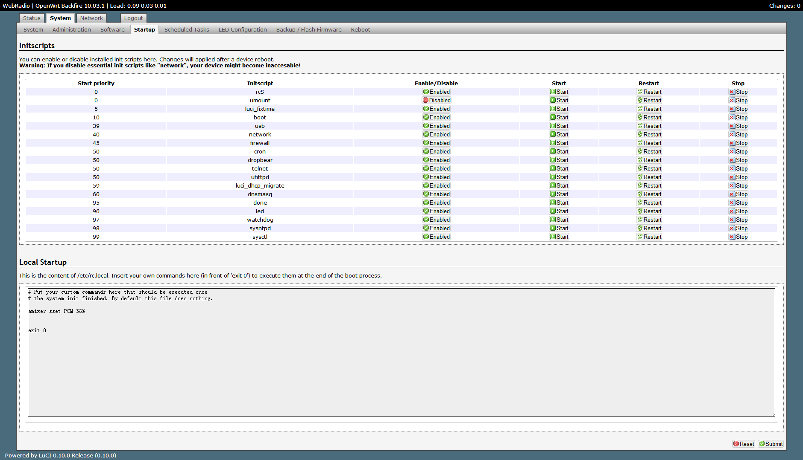

# ReadME

## Firmware Version	OpenWrt Backfire 10.03.1 / LuCI 0.10.0 Release (0.10.0)

http://downloads.openwrt.org.cn/openwrtcn_img/db120/db120-openwrt.org.cn-backfire-10.03.166-0620.bin

http://downloads.openwrt.org.cn/openwrtcn_img/rg100a/rg100a-openwrt.org.cn-backfire-10.03.166-0620.bin

alsa-lib 	1.0.24.1-1

alsa-utils 	1.0.24.2-1

kmod-usb-audio 	2.6.32.27-1

kmod-usb-core 	2.6.32.27-1

kmod-usb-ohci 	2.6.32.27-1

openssh-sftp-client 	5.8p2-2

openssh-sftp-server 	5.8p2-2

## */1 * * * * /usr/share/webradio/mplayer -slave -input file=/tmp/fifofile -playlist /usr/share/webradio/radiolist

## amixer sset PCM 38%

http://www.crystalradio.cn/thread-466848-1-1.html

https://download.csdn.net/download/rzd4evr/4583381
